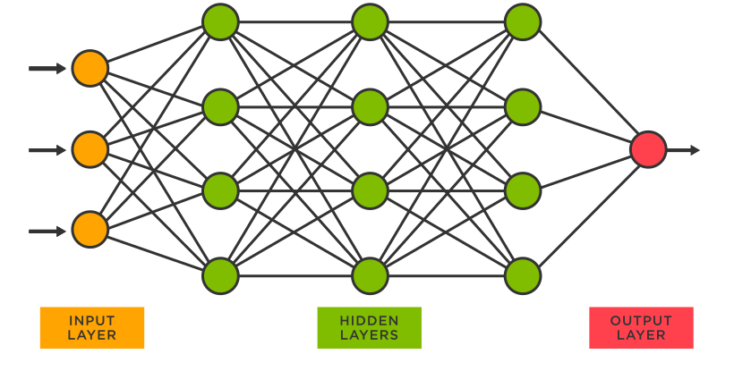

## Charity Funding Predictor

## Background

Used Tensorflow to create a binary classifier for the non-profit organisation Alphabet Soup. This uses a neural network model to predict whether funding applicants will be successful. A dataset of more than 34,000 organisations that received funding historically was used to create the features the algorithm uses to make predictions. Used Pandas and the Scikit-Learn’s `StandardScaler()`, to preprocess the dataset to compile, train, and evaluate the neural network model.

## Instructions

### Step 1: Preprocess the data

### Step 2: Preprossing the data
1. charity_data.csv located in the [/Resources](Resources/) directory was read into a Pandas Dataframe 
3. The number of unique values for each column were determined.
4. For those columns that had more than 10 unique values,  data points for each unique value were also determined
6. Using the number of data points for each unique value a cutoff point was chosen to bin "rare" categorical variables into a new value, `Other`
7.`pd.get_dummies()` was used to encode categorical variables

### Step 2: Compile, Train, and Evaluate the Model

Using TensorFlow a neural network model, was used to create a binary classification model that can predict if an Alphabet Soup–funded organisation will be successful based on the features in the dataset. 
Needed to establish how many inputs there were, before determining the number of neurons and layers in the model. The model was evaluated using the test data to determine the loss and accuracy. The code is located in the [/Notebooks](Notebooks/) directory and is named Preprocessing_code.ipynb
The results were saved and exported to an HDF5 file, named `AlphabetSoupCharity.h5` located in the [/Resources](Resources/) directory. 

### Step 3: Optimize the Model

The model was optimised in order to achieve a target predictive accuracy higher than 75%. The optimisation notebook is located in the [/Notebooks](Notebooks/) directory named AlphabetSoupCharity_Optimization.ipynb 

Three attempts were made to achieve an accuracy of >75%:
* Increased hidden layers 
* Increased number of epochs 
* Increased neurons in hidden layers 

### Step 4: Report on the Neural Network Model

The report on the performance of the deep learning model is located in the main directory named Report.md.
The report provides:
* An overview of the analysis 
* Data preprocessing and the compiling and training of the model
* Summary of overall results of the deep learning model, including a recommendation for how a different model could solve this classification problem, supported with an explanation

